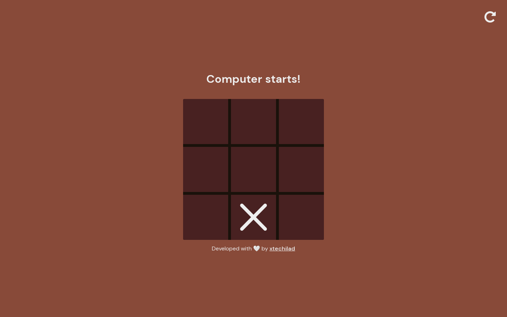

# Tic Tac Toe Game

This repository contains a simple Tic Tac Toe game implemented using HTML, CSS, and JavaScript. The game allows users to compete against the computer on a 3x3 grid.

## Game Features

- User-friendly interface with a responsive design.
- Real-time gameplay.
- Alternate turns between players (User and Computer).
- Automatic detection of winning combinations and declaration of the winner.
- Option to restart or reset the game and play again.

## Technologies Used

The game is built using the following technologies:

- HTML: Provides the structure and layout of the game.
- CSS: Adds styles and visual enhancements to the game interface.
- JavaScript: Implements the game logic and interactivity.

## Usage

- Upon opening the game, you will see a 3x3 grid representing the Tic Tac Toe board.
- The game may start with the user's turn or the computer's turn.
- The game continues until one player wins or the game ends in a draw.
- If a player wins, a message will be displayed announcing the winner.
- To restart the game at any point, click the "Restart" button at the top right corner.

## License

This project is licensed under the [MIT License](LICENSE).

Thank you for visiting this repository! Enjoy playing Tic Tac Toe!
